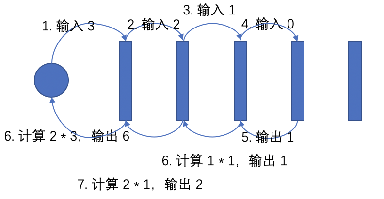
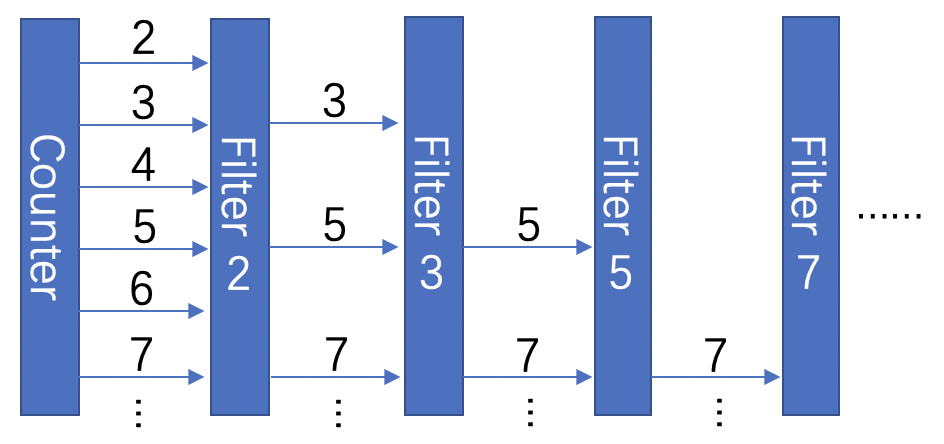

传统的程序语言设计都不会将输入输出作为语言的核心，但 Tony Hoare 认为输入输出是基本的编程原语，且通信顺序进程（Communicating sequential processes，CSP）的并行组合（这里可能用「并发」会更为准确）是基本的程序组织方法。Go 语言的并发设计就是基于 CSP 模型的。

在[最初的 CSP 模型](https://www.cs.cmu.edu/~crary/819-f09/Hoare78.pdf)中，程序总由若干个可以相互通信的进程构成，其中每一个进程内部是顺序执行的（这也就是 CSP 名称的含义）。注意这里的「进程」并不一定指操作系统中的进程，也不一定是操作系统的线程，它是一个抽象的概念，代表一组计算的序列，例如 goroutine 这种在应用层调度的计算序列也算 CSP 中的「P」。与 Go 语言不同的地方在于，这个最初的设计中并没有通信管道的概念，每个进程是直接和另一个进程进行通信的，但在 Go 语言中，goroutine 是匿名的，一个 goroutine 并没有办法直接将消息发给另一个 goroutine，为了实现 goroutine 之间的通信，Go 语言提供了 first class 的 channel，消息通过 channel 来从一个 goroutine 发到另一个 goroutine。而且，Go 语言也不要求 goroutine 内部是顺序执行的，goroutine 内部可以创建更多的 goroutine，并发地完成工作。

下面，我们通过例子说明基于 CSP 模型是如何组织程序的。

## 阶乘计算

首先来看的是一个计算阶乘的例子，阶乘的一个简单的递归实现可以是这样的：

```haskell
fact 0 = 1
fact n = n * fact (n - 1)
```

而基于 CSP 组织程序，我们可以这样做：

```go
// 阶乘计算的实体
func FactCalc(in <-chan int, out chan<- int) {
	var subIn, subOut chan int
	for {
		n := <-in
		if n == 0 {
			out <- 1
		} else {
			if subIn == nil {
				subIn, subOut = make(chan int), make(chan int)
				go FactCalc(subIn, subOut)
			}
			subIn <- n - 1
			r := <-subOut
			out <- n * r
		}
	}
}

// 包装一个阶乘计算函数
func MakeFactFunc() func(int) int {
	in, out := make(chan int), make(chan int)
	go FactCalc(in, out)
	return func(x int) int {
		in <- x
		return <-out
	}
}
```

`MakeFactFunc` 就是简单地封装一下 `FactCalc`，获取一个计算阶乘的函数。主要的计算是由 `FactCalc` 进行的。

每一个 `FactCalc` 都会被作为一个独立的 goroutine 来执行，对于第 i 个 goroutine 而言，它先从第 i - 1 个 goroutine 中读入一个数字 `n`，然后，如果 `n > 0`，这个 goroutine 需要做 3 件事：

1. 向第 i + 1 个 goroutine 写入一个 `n - 1`
2. 从第 i + 1个  goroutine 处读回来一个数字 `r`
3. 将 `n * r` 写入第 i - 1 个 goroutine

否则，则向第 i - 1 个 goroutine 处写入一个 1。

如前所述，由于 Go 语言不支持直接向一个 goroutine 发消息，所以这里的消息收发都要基于 channel 进行。我们可以看到，一旦 `FactCalc` 发现自己无法完成阶乘问题的计算工作，它就会创建另一个 goroutine（只会创建一次），并将子问题发送给这个 goroutine 进行处理，这会形成一个 `FactCalc` goroutine 的链条，链条上的每一个 goroutine 都与前一个和后一个 goroutine 进行通信（这就是前文所说的「若干个可以相互通信的进程」）。

我们又了这样的阶乘计算器后，我们可以这么去使用它：

```go
const limit = 5
func main() {
	fact := MakeFactFunc()
	for i := 0; i < limit; i++ {
		fmt.Println(fact(i))
	}
}
```

执行程序，我们可以看到这样的输出：

```
1
1
2
6
24
```

相比于直接使用递归函数调用，这个实现方式非常不直观。下面这个图可能能帮助理解：



这里的圆形为调用者，每一个矩形都为一个 goroutine，当我们尝试计算 `fact(3)` 时，会将 3 写入最前面的 in channel 中，数据开始从第一个 goroutine 向后流动。第一个 goroutine 会从这个 channel 中读到这个 3，它将 `3 - 1` 写入下一个 in channel 中，然后开始阻塞等待 out channel 出现第二个 goroutine 计算的结果，第二个、第三个 goroutine 的计算是类似的，等到第 4 个 goroutine 从 in channel 中读取输入时，它发现这是一个 0，于是直接向 out channel 写入一个 1，此时数据开始从最后一个 goroutine 往回流动，经过第三个和第二个 goroutine 的计算后，第一个 goroutine 会获得 2，然后将 `2 * 3` 输出。

注意到这里进行阶乘计算的实体并不是递归的函数，而是并发的 goroutine，它们之间通过 channel 进行通信， 每个 goroutine 都将计算拆分并发送给其他 goroutine 进行处理，直到计算变为 trivial 的情况。当然了，这个实现相比简单的递归函数会显得很啰嗦，我们在实际使用中也不会这么做，但这个例子说明了如何在 CSP 模型下，利用数据的流动实现我们常见的递归。

## 素数筛

下面的一个例子中，我们使用筛法来计算素数。所谓素数筛，大概就是对正整数 2 ～ n 进行遍历，然后对每一个数字都进行一次筛选，只留下是素数的部分，对于第 i 位的筛选，我们需要依赖前面已经晒出的 m 个素数，当且仅当这 m 个素数都无法整除第 i 位的数字时，这个数字可以通过这一位的筛选，也就是这样：

```haskell
primes = primesFilter [2..]
  where primesFilter (p:xs) =
          p : primesFilter [x | x <- xs, x `mod` p /= 0]
```

上面这个实现利用了 Haskell 的惰性求值能力，但对于大多数语言而言，我们的实现都不可能这么简洁，基于传统的顺序计算的思路，程序都会比较啰嗦，而且关键是很不清晰。而在 CSP 模型下，我们可以这么实现：

```go
func Counter(out chan<- int) {
	for i := 2; ; i++ {
		out <- i
	}
}

func PrimeFilter(prime int, in <-chan int, out chan<- int) {
	for {
		i := <-in
		if i%prime != 0 {
			out <- i
		}
	}
}

func PrimeSieve(out chan<- int) {
	c := make(chan int)
	go Counter(c)
	for {
		prime := <-c
		out <- prime
		newC := make(chan int)
		go PrimeFilter(prime, c, newC)
		c = newC
	}
}
```

可以看到，我们的素数筛由三个部分组成，首先，`Counter` 从 2 开始依次产生自然数。`PrimeFilter` 就是每一层素数的过滤器，每一层过滤器只持有一个输入 channel 一个输出 channel 和一个素数 `prime`，它将不断从输入 channel 中读入数字，并将其中无法被 `prime` 整除的部分输出。`PrimeSieve` 则是一个完整的素数筛，它每获得一个素数，都将素数输出，并创建一个新一层的过滤器，因此整个过程大概是这样的：



`PrimeSieve` 可以向 out channel 中依次输出被筛出来的素数，这个过程是惰性的，直到我们从 out channel 中取出素数，下一个素数才会被计算。我们可以这样去使用它：

```go
func main() {
	primes := make(chan int)
	go PrimeSieve(primes)
	for i := 0; i < 5; i++ {
		fmt.Println(<-primes)
	}
}
```

执行程序，我们可以看到这样的输出：

```
2
3
5
7
11
```

从这两个例子中我们可以看到 CSP 模型不一定是用于并行计算，至少在这两个例子中，每一个 goroutine 在进行计算之后都在阻塞等待，同一时间事实上仅有一个活跃的 goroutine，但 Go 语言对 CSP 并发模型的支持能让整个设计变得简单清晰（「并发」和「并行」的区别可以参考[这个视频](https://vimeo.com/49718712)）。这反映到 Go 语言设计上的要点有两个：

1. Goroutine 之间可以通过 channel 来进行通信，channel 是 first class value，可以被直接传递。在这种情况下，goroutine 之间很容易进行协作，共同完成一个计算工作。
2. Goroutine 十分轻量，可以在单机建立大量 goroutine 而不至于消耗过多性能。对于素数筛的例子，每计算多一个素数都需要多一个 goroutine。而阶乘计算的例子，输入参数 + 1 都需要多一个 goroutine。显然，如果没有系统层调度的「process」的支持，CSP 所能应用的范围就非常局限了。

下面我们再通过另外一个例子看一下 Go 语言的其他设计点。

## 信号量

一个信号量有两个操作，分别称为 V（`signal()`）与P（`wait()`）。其运作方式如下：

1. 初始化，信号标 S 一个非负数的整数值。
2. 执行 P 操作（`wait()`）时，信号标 S 的值将尝试被减少。当信号标 S 非正数时，进程会阻塞等待；当信号标 S 为正数时，S 被成功减少，进程可以继续往下执行。
3. 执行 V 操作（`signal()`）时，信号标 S 的值将会被增加。

在 CSP 模型下，我们可以这样实现：

```go
type Semaphore struct {
	inc chan struct{}
	dec chan struct{}
}

func (sem *Semaphore) Wait() {
	sem.dec <- struct{}{}
}

func (sem *Semaphore) Signal() {
	sem.inc <- struct{}{}
}

func MakeSemaphore(initVal int) *Semaphore {
	sem := Semaphore{
		inc: make(chan struct{}),
		dec: make(chan struct{}),
	}
	go func(s int) {
		for {
			if s > 0 {
				select {
				case <-sem.inc:
					s = s + 1
				case <-sem.dec:
					s = s - 1
				}
			} else {
				<-sem.inc
				s = s + 1
			}
		}
	}(initVal)
	return &sem
}
```

`*Semaphore` 有两个操作，分别是 `Wait` 和 `Signal`，它们分别向 `dec` channel 和 `inc` channel 发消息。而 `MakeSemaphore` 中创建的 goroutine 则会根据 `s int` 状态的不同选择不同的操作，如果 `s > 0`，则从 `inc` channel 或 `dec` channel 中**随机**读取一个值，并将 `s` 的值进行增加/减少 1，否则，从 `inc` channel 中读取一个值，并将 `s` 的值增加 1。注意这里的「随机」是非常重要的，如果 `inc` 和 `dec` 同时都有数据可读，则实际从哪个 channel 中读出数据是不确定的，正是因为 Go 语言的 `select` 是随机的，我们才可以在这里用它来进行调度。显然，在大多数语言中，如果要实现 channel 这样的类型，一般是以库的形式进行实现，而 Go 语言将其上升到了语言层面实现，这样虽然显的不够纯粹干净，但这样可以通过更方便的语法实现 `select` 这样强大的功能，如果实现为库的形式，是难以做到这个程度的。

## 一个简单的服务模板

在这个例子中，我们将基于 Go 语言实现一个极简单的服务模板，代码如下：

```go
type Input struct {
	Req   interface{}
	State interface{}
}

type Output struct {
	Rsp   interface{}
	State interface{}
}

type Handler = func(input Input) (Output, error)

type Response struct {
	Result interface{}
	Error  error
}

type InMessage struct {
	Req     interface{}
	OutChan chan<- Response
}

type Service struct {
	inChan chan<- InMessage
}

func (service *Service) RpcCall(request interface{}) (interface{}, error) {
	outChan := make(chan Response)
	service.inChan <- InMessage{request, outChan}
	rsp := <-outChan
	if rsp.Error != nil {
		return nil, rsp.Error
	}
	return rsp.Result, nil
}

func MakeService(handler Handler, initState interface{}) *Service {
	inChan := make(chan InMessage)
	go func(state interface{}) {
		for {
			in := <-inChan
			out, err := handler(Input{in.Req, state})
			if err != nil {
				in.OutChan <- Response{nil, err}
			} else {
				state = out.State
				in.OutChan <- Response{out.Rsp, nil}
			}
		}
	}(initState)
	return &Service{inChan}
}
```

这里的 `Service` 是一个服务模板，我们通过 `MakeService` 来创建它。在创建服务模板的时候，我们要求调用者传入一个请求处理函数 `handler func(input Input) (Output, error)`，从类型可以知道，它接受一个请求，然后进行处理，并返回响应。请求和响应中都带有状态，`handler` 可以借此保存和修改状态，由于模板并不知道状态是什么，因此，`MakeService` 还要求调用者传入一个初始的状态 `initState`。然后，`MakeService` 会启动一个 goroutine，这个 goroutine 不断从 `inChan` 读入请求，并调用 `handler` 进行处理，最终将响应通过 `outChan` 发回给调用方。`RpcCall` 简单封装了一下从 `inChan` 输入请求，从 `outChan` 读取响应的过程。我们可以使用这个模板这样实现一个简单的电话本服务：

```go
type Query struct {
	Name string
}

type Insert struct {
	Name  string
	Phone int
}

type PhoneBookService = Service

func (s *PhoneBookService) Insert(name string, phone int) {
	s.RpcCall(Insert{name, phone})
}

func (s *PhoneBookService) Query(name string) (int, error) {
	phone, err := s.RpcCall(Query{"Tom"})
	if err != nil {
		return 0, err
	}
	return phone.(int), nil
}

func MakePhoneBookService() *PhoneBookService {
	return MakeService(func(i Input) (Output, error) {
		st := i.State.(map[string]int)
		switch req := i.Req.(type) {
		case Query:
			x, ok := st[req.Name]
			if !ok {
				return Output{nil, nil}, fmt.Errorf("%v no found", req.Name)
			}
			return Output{x, st}, nil
		case Insert:
			st[req.Name] = req.Phone
			return Output{nil, st}, nil
		default:
			return Output{nil, nil}, fmt.Errorf("unknonw input: %v", req)
		}
	}, make(map[string]int))
}

func main() {
	service := MakePhoneBookService()
	phone, err := service.Query("Tom")
	if err != nil {
		fmt.Println("query err:", err)
	} else {
		fmt.Println("query succ:", phone)
	}
	service.Insert("Tom", 123456)
	phone, err = service.Query("Tom")
	if err != nil {
		fmt.Println("query err:", err)
	} else {
		fmt.Println("query succ:", phone)
	}
}
```

这个电话本功能很简单，只有 `Insert` 和 `Query` 两种方法。`Service` 模板的作用是将整个 Go 语言的并发模型封装在函数调用内，从 `PhoneBookService` 的实现中，我们可以发现，这里没有任何 goroutine 的产生代码，也没有 channel 的使用，仅仅出现了简单的函数调用。对于 `handler` 的实现，里面也是一个简单的循环。这样一来，具体服务的实现者就不需要接触 Go 语言的并发模型，也可以实现简单的服务了。

执行程序，我们可以看到如下的输出：

```
query err: Tom no found
query succ: 123456
```

在这里，我们可以注意到 Go 语言的另外两点设计，一个是使用错误返回值的错误的处理方式，另一个是只有接口没有泛型。

首先说错误处理。

Go 语言的错误处理方式有很大争议，支持者认为，Go 的错误返回值方式让错误的出现更加明确，不会扰乱让开发者的逻辑，更清晰地表达了意图。而反对者则认为异常抛出的缺失导致 Go 代码的错误处理非常冗长，且频繁打断主要逻辑。显然，这两个观点都有各自的道理，且在不同的语言里我们也看到了这两种错误处理方式的广泛应用，但是我认为在 Go 的并发模型的限制下，使用错误返回值的方式是一个合理正确的选择。如前所述，Go 语言每当创建一个 goroutine 之后，这个 goroutine 就和创建者没有什么关系了，它甚至不能像线程一样直接被等待执行结束。goroutine 和 goroutine 唯一进行关联的方式就是通过 channel 的消息传递。假设 Go 语言支持了抛出异常，那么，一个 goroutine 中抛出了一个没有被捕获的异常，这个异常将会导致什么呢？由于没有任何实体有责任捕获并处理这个异常，因此这里唯一正确的处理方式就是 panic 了，这个处理显然是很不可靠的，一个 goroutine 中的异常导致整个系统的 panic 无法让人接受。当然，有人会说，那在每个 goroutine 的最顶层都 try-catch 一下就可以了。那问题又来了，try-catch 之后呢？如果出现了一个已经被抛到顶层的异常，说明这个异常应该无法被这个 goroutine 自身处理了，应该交由其监视者来处理，例如上面的例子中，调用者就应该负责处理 `Service` goroutine 中产生的错误。那么，在这个时候，唯一正确的做法就是将抛出的异常以错误值的形式通过 channel 发送给监视者，以期待上层能够正确处理这个异常。那么这样一来，开发者就必须频繁混合使用两种错误处理方式，这样的开发方式是极其混乱且易错的。所以，使用错误返回值的方式应该是更加合理统一的方式了。

第二点，关于泛型的问题。

Go 语言只有接口没有泛型，这导致了很多麻烦，例如我们无法实现带有静态检查的自定义容器，泛型算法也难以实现。许多 Go 语言的开发者对于泛型的看法是：你不需要这个。我承认在实际工程中泛型的使用场合远少于接口，但是，即便从服务开发这个 Go 语言的主战场来看，泛型的必要性也依然很高。从上面的例子中我们可以看到，代码中大量充斥着 `interface{}` 和对 `interface{}` 的类型转换。其原因就是我们在实现这样一个服务模板时，我们并不知道模板的使用者需要处理怎样的 request，返回怎样的 response，也不知道这里的 state 是什么。由于泛型的缺失，我们的代码相当于失去了静态的类型检查，将静态的类型错误变为了运行时错误，这样一来，Go 语言的静态能力就缺失了很多，甚至我们可以说，Go 语言泛型的缺失使得 Go 语言在类型安全性上不如带有泛型能力的静态类型语言，却比这些语言在使用上还要更啰嗦（各种类型转换和错误判断）。

## 总结

Go 语言是一个原生支持并发的语言，其并发模型基于 CSP 模型。通过使用 Go 语言的并发能力，我们可以设计出非常直观易懂的代码。经过上面几个例子的分析中我们可以看出，从并发模型和并发程序设计的角度来看，Go 在语言设计上的优势在于：

1. 拥有轻量的应用层进程 goroutine，允许开发者基于大量 goroutine 来设计并发程序
2. First class channel 的支持，使得 goroutine 之间能够很轻易地相互合作
3. `select` 关键字的随机能力使得开发者可以基于 channel 来对程序实现调度
4. 使用返回值的形式处理错误，很好地契合了 goroutine + channel 的并发模型

而 Go 在语言设计上的劣势在于：

泛型的缺失导致许多程序设计变得脆弱，增加代码量且失去了安全性
